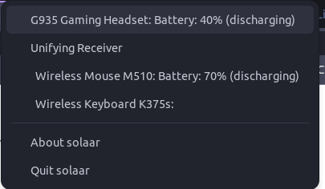

Linux é meu sistema operacional principal desde 2019. Complementando o [post da semana passada sobre WSL](https://dev.to/1cadumagalhaes/configuracao-do-windows-para-desenvolvimento-blk), decidi começar essa série de posts ensinando tudo que você precisa saber para conseguir usar Linux, mesmo que dentro do WSL.

## Tudo que eu preciso saber sobre?

Meu objetivo aqui é simples: prover toda informação disponível para você (desenvolvedor) começar e conseguir usar a ferramenta da vez. Não pretendo responder tudo que você **pode** ou **deveria** saber, apenas o necessário.

## O que é Linux

De forma geral, Linux é usado pra descrever os sistemas operacionais que são baseados no Kernel Linux, mas não vamos entrar em detalhe aqui. Podemos considerar como um **tipo** ou **conjunto** de sistemas operacionais, cujo princípio está no kernel que é de código aberto. Por isso, toda distribuição Linux também é de código aberto.

## Quando eu deveria usar Linux?

Minha resposta pessoal é que todos deveriam testar sistemas operacionais diferentes, mas isso fica pra um post a parte. Quando pergunto para usuários de Linux o motivo de escolherem esses sistemas, as respostas são:

### 1. O sistema é Open Source

O fato de ser de código aberto significa que a comunidade pode contribuir ativamente com o desenvolvimento, resolver bugs, encontrar falhas, e principalmente estender o sistema para as próprias necessidades.

### 2. Personalização

Vou mencionar brevemente mais tarde, mas existem milhares de sistemas diferentes baseados em Linux. Os sistemas podem ter diferenças na arquitetura, no sistema de arquivos, no gerenciamento de pacotes, no tipo de interface gráfica, na disposição dos elementos da UI, nos softwares que já vem instalados.

O ecossistema Linux é tão rico porque os usuários (e desenvolvedores) não satisfeitos com a forma como usam seus computadores resolvem fazer as alterações que melhoram suas experiências.

### 3. A comunidade (e seus softwares e suporte)

A comunidade Linux é incrivelmente ativa. Acho que muito por necessidade, visto que por muito tempo a utilização do sistema era somente para usuários avançados (seja para personalização, por compatibilidade de software, para resolver bugs). Você pode procurar como resolver algum problema, como instalar algum programa, como fazer escrever um script, resolver algo usando a linha de comando e na maioria das vezes vai encontrar não só uma resposta, mas uma discussão e uma explicação de como funciona e onde você pode achar mais detalhes.

E graças a comunidade, muitos dos problemas comuns acabam virando um pacote (basicamente um programa), que na maioria das vezes é distribuido gratuitamente, e tem seu código aberto. Mesmo quando as marcas (logitech por exemplo, mas a lista é imensa) escolhem não oferecer suporte dos seus dispositivos ou - dos softwares que vem com eles -  para Linux, existem grandes chances de você encontrar uma opção (para dispositivos sem fio da logitech por exemplo, deixo a recomendação do [Solaar](https://pwr-solaar.github.io/Solaar/devices.html), que não só é um software mais leve que o oficial, mas que oferece a maioria das opções disponíveis e ainda tem um ícone na barra de tarefas com a carga da bateria, e manda notificações quando está acabando)



### 4. Segurança

Devido ao design, e (novamente) pela comunidade, Linux é considerado simplesmente mais seguro que Windows. A quantidade de usuários monitorando, identificando e resolvendo vulnerabilidades faz com que os problemas sejam resolvidos muito rapidamente, além de ter um sistema de controle de acesso muito robusto. O fato de ter uma base de usuários menor que windows também significa que vai ser um alvo menos procurado para ataques como vírus ou malwares, que normalmente vão ser desenvolvidos para funcionar em Windows (apesar disso, não significa que você estará livre de preocupações de segurança).

### 5. Performance

Linux precisa de pouquíssimos recursos para funcionar, de forma que existem distribuições focadas em economizar recursos. O Ubuntu Mate por exemplo, roda em computadores com 1GB de memória RAM, 10GB de espaço em disco e um processador de 1GHz, isso contando com uma interface completa e sem nenhum “corte” de funcionalidade. Pesquisando na internet você vai encontrar vários exemplos de como pessoas “revitalizaram” seus computadores antigos instalando algum Linux neles.

### 6. Utilização em servidores

Linux é o sistema mais utilizado para servidores, basicamente pelos motivos citados acima.

## Por onde começar?

Bom, se você é desenvolvedor, um bom começo é o WSL, que já expliquei como configurar na semana passada. Dentro do WSL você vai ter um terminal (que é basicamente o que teria acesso num servidor), e apesar de usuários comuns não precisarem abrir a linha de comando para nada (dependendo do sistema que estiverem usando), conhecer as ferramentas de linha de comando pode ser bem importante.

Se você quer somente testar, você pode escolher qualquer distribuição Linux, criar um USB bootável com uma instalação do sistema e começar a usar. Isso não vai mexer com a instalação do seu windows e não vai alterar nenhum arquivo no seu sistema, de forma que você pode fazer isso em praticamente qualquer computador.

Minha recomendação é começar com qualquer variação de Ubuntu, que por ser o sistema mais utilizado é o que tem a maior comunidade e suporte. Eu particularmente uso o PopOS, mas você pode pesquisar por “ubuntu flavours” e escolher o que achar mais bonito. Se quiser uma experiência mais próxima do que se tem com o Windows, o Zorin OS pode ser uma boa escolha.

## Linha de comando

Bom, eu aprendi os comandos conforme a necessidade, então é complicado levantar exatamente o que você vai precisar usar. Vou copiar o conteúdo de uma palestra que dei uma vez sobre dicas de Terminal, e que serviu de inspiração para o post [3 dicas de terminal para Engenheiros de Dados no blog da DP6](https://blog.dp6.com.br/3-dicas-de-terminal-para-engenheiros-de-dados-11587d54802b)

### Comandos que você precisa saber

Abaixo estão os comandos mais essenciais para utilização do sistema. Com eles você aprende a navegar entre pastas e a fazer todo o gerenciamento básico de arquivos. Como bônus, a maioria desses comandos são bem semânticos, então coloquei a explicação em inglês do seus significados para os que sei.

```bash
# Comandos que você precisa saber:

ls [path] -a -l -h -R # listing, lista os arquivos e diretórios. -a ou –all lista inclusive ocultos, -l informações extras e -h formata de forma legível (human readable)
cd [path] # change directory, serve para navegar entre as pastas. Para voltar uma pasta, use ..
cp [path ou file] [dest] -r # copy, copia o arquivo ou pasta para o destino. -r significa recursivo
mv [path ou file] [dest] -r # move, move o arquivo ou pasta para o destino. Pode ser usado para renomear
rm [path ou file] [dest] -r -f # remove, apaga arquivos ou diretórios
mkdir [path] # make directory, cria pastas
rmdir [path] -r # remove directory, apaga pastas
touch [file] # cria um arquivo vazio com nome informado no parâmetro [file]
nano [file] # editor de texto, sabia mais em https://www.vivaolinux.com.br/artigo/Introducao-ao-Linux-O-editor-de-texto-Nano
vi [file] # editor de texto, https://www.vivaolinux.com.br/artigo/Guia-rapido-VI
sudo [comando] # super user do, usado para executar o comando com permissão elevada
clear # limpa a interface do terminal
```

### Comandos úteis

Aqui alguns comandos para aplicações mais específicas, como ver parte do conteúdo de um arquivo, pesquisar um arquivo dentro de uma pasta, alterar o conteúdo em batch, verificar o que está rodando no seu computador, baixar arquivos, gerenciar permissões e etc

```bash
head [file] -n=[num] # imprime as 10 primeiras linhas do arquivo, ou as [num] linhas
tail [file] -n=[num] # imprime as 10 últimas linhas do arquivo, ou as [num] linhas'
find # procurar por arquivos e diretórios
grep # procura um padrão (de texto ou regex) no arquivo ou na string
sed # stream editor, pode fazer transformações de texto no arquivo ou string
awk # procura um padrão (de texto ou regex) no arquivo ou na string, mas usa uma linguagem de processamento
top # lista os processos sendo executados no pc
env # lista ou cria variáveis de ambiente na seção do terminal
chmod # muda o acesso ou permissão do arquivo, ou diretório
chown # muda o proprietário do arquivo ou diretório
wget [options] [url] # Realiza requisições HTTP para a URL informada, para uma requisição simples não é necessário passar nenhum parâmetro adicional a URL, o comando possui vários parâmetros complementares
Perguntas frequentes
```

## O mais importante

**Nunca** - sério, nunca - **saia copiando comandos de fontes não oficiais sem entender exatamente o que está fazendo.** Mesmo em tutoriais oficiais de instalação de ferramentas, leia os comandos antes de copiar e executar no seu computador. A linha de comando é uma ferramenta muito poderosa, e a partir do momento em que você da permissão (ao executar algo com sudo, por ex), qualquer alteração pode ser feita.

Se não souber o que um comando faz, você pode usar o site [https://explainshell.com/](https://explainshell.com/), que explica todos os pedaços de um comando.

Além disso, sempre leia o que está escrito no terminal antes de confirmar qualquer coisa. Eu sempre gosto de dar o exemplo do vídeo [Linux HATES ME do canal Linus Tech Tips](https://www.youtube.com/watch?v=0506yDSgU7M), onde ele tentou fazer um desafio de usar Linux por 30 dias. Nos primeiros minutos de utilização ele tentou instalar a Steam, e quando não conseguiu recorreu a linha de comando. O terminal explicou que ele estava fazendo algo que iria danificar o sistema e pediu para ele digitar uma frase inteira como confirmação, e ainda assim ele confirmou. Depois disso o sistema não abriu mais. (basicamente ele tentou a instalação num dia em que a Valve subiu um pacote corrompido de instalação da steam, e o sistema tentou fazer de tudo pra que ele não instalasse)

## Perguntas frequentes

### Linux ou Windows?

Depende. Sistema Operacional é uma escolha pessoal, então você deve usar o que atende as suas necessidades. Mas eu defendo que as pessoas usam Windows porque é a opção que foram apresentadas, e não porque ele atende as necessidades. É bizarro esperar que todas as pessoas do mundo vão usar o computador da mesma forma, então realmente acho que todos deveriam testar vários sistemas diferentes. Da mesma forma, a maioria das interfaces de Linux são feitas para utilizar de formas bem diferentes do windows. Além disso, Android é Linux e serve de exemplo disso. O Android de cada marca é diferente. Sejam detalhes na interface, a forma de utilizar, o menu de notificações. E hoje já é natural as pessoas preferirem uns a outros.

### Qual a melhor distro Linux?

Depende. Novamente, é uma escolha pessoal. Como mencionei antes, recomendo Ubuntu pela comunidade e suporte, e uso o PopOS porque me adaptei bem a interface e sou muito mais produtivo do que com Windows.

### Eu consigo fazer no Linux tudo que faço no Windows?

Resposta curta: não. Resposta certa: sim, se você (ou alguém) desenvolver algo. Como já falei, a maioria das marcas não oferece software com suporte a Linux, por exemplo. Alguns jogos como Valorant tem seu anticheat baseado no kernel de Windows, então é impossível executar no Linux. Alguns outros, como o Fortnite simplesmente escolhem não dar suporte.  Caso você se interesse por jogar no Linux, o [Proton DB](https://www.protondb.com/) tem o status de todos os jogos na steam, se as pessoas conseguiram jogar e como.

## Onde encontrar mais informações

Eu aprendi principalmente com 2 canais:

- [LinuxTIPS](https://www.youtube.com/@LinuxTips)
- [Diolinux](https://www.youtube.com/@Diolinux)

Ambos brasileiros e com muito conteúdo de qualidade. O diolinux também tem vários cursos disponíveis para membros do canal, e o LinuxTIPS tem o [Treinamento Linux Essentials](https://www.linuxtips.io/course/linux-essentials) (além de alguns mais avançados), que é sensacional. Fora isso aprendi em issues do github, perguntas do stackoverflow e posts de comunidade por ai.

Se você tiver alguma recomendação de criador de conteúdo que fale sobre Linux, deixa o comentário aqui!

## Conclusão

A verdade é que você não precisa saber muito para conseguir usar Linux. Eu comecei basicamente escolhendo uma distro, instalando e usando. Conforme encontrei barreiras, fui aprendendo mais coisas, mas na maioria das vezes você  vai ter uma experiência bem satisfatória sem ter que se preocupar muito.

Me diz o que você achou desse tipo de post, e se você gostaria que isso virasse um vídeo no Youtube! Independente do resultado, o post da semana que vem será sobre Docker. Me acompanha no twitter pra saber mais.

Espero que isso tenha sido útil para alguém, até a próxima!
