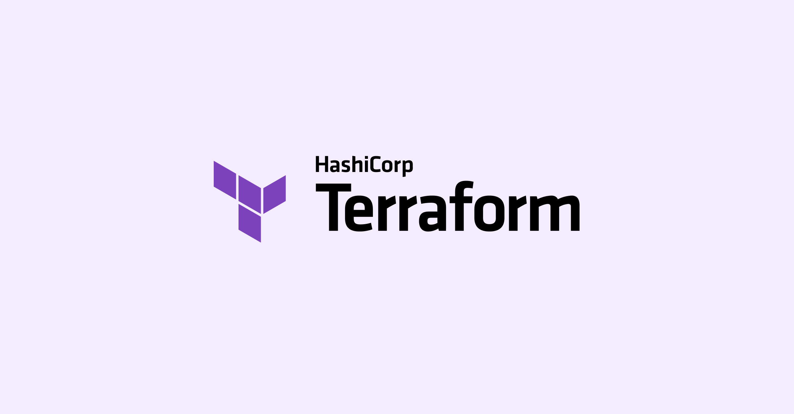
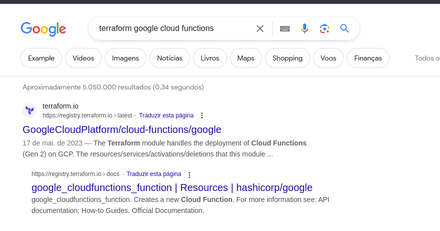
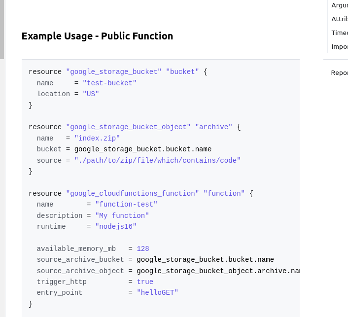

Terraform é uma ferramenta open source desenvolvida para facilitar a criação, gerenciamento e a automatização da **infraestrutura como código** (que vamos chamar de IAC, da sigla *infra as code)*. Sua principal vantagem é que você escreve a sua infraestrutura de forma declarativa, e a ferramenta fica responsável por implementar seus recursos de maneira consistente.

A grande maioria de exemplos de utilização de terraform pela internet é com AWS. Como trabalho com Google Cloud, vou fazer os exemplos baseados nisso. 

## Tudo que eu preciso saber sobre?

Meu objetivo aqui é simples: prover toda informação disponível para você (pessoa desenvolvedora) começar e conseguir usar a ferramenta da vez. Não pretendo responder tudo que você **pode** ou **deveria** saber, apenas o necessário. 

## O que é IAC

Antes de seguir e falar especificamente do Terraform, vamos entender um pouco sobre sua base.

Se você que está lendo já formatou um computador pessoal, sabe como pode dar trabalho instalar todos os softwares necessários para fazer alguma tarefa. Agora imagine se o seu trabalho for provisionar computadores para um servidor ou uma aplicação, e que você precisa:

- Criar máquinas virtuais
- Instalar programas nelas
- Criar um banco de dados pra aplicação
- Fazer as configurações de rede e firewall

Nesse caso, dependendo da quantidade de vezes que você for fazer isso, faz sentido pensar em automatizar, certo?

Por causa disso, ao longo dos anos surgiram várias ferramentas de automação para facilitar esse tipo de provisionamento. A primeira que eu ouvi falar foi o [Ansible]([https://www.ansible.com/](https://www.ansible.com/)), da Red Hat. A ideia é que você escreva arquivos de configuração definindo **o que** precisa ser criado, e de forma simplificada, **qual a ordem** das dependências. Isso ajuda a subir infraestruturas de forma consistente.

## O que é Terraform

Nas palavras (traduzidas livremente por mim) da Hashicorp, empresa responsável pelo Terraform:

> Terraform é uma ferramenta de infaestrutura como código que permite que você construa, mude e versione infraestrutura de forma segura e eficiente.

A ideia é simples: você descreve sua configuração em arquivos, onde você escreve todos os recursos da sua infra (máquinas virtuais, configurações de rede, bancos de dados - virtualmente, qualquer coisa). 

O terraform usa a linguagem HCL (Hashicorp Configuration Language) nos seus arquivos, e nele você declara os **recursos**, que representam os objetos de infraestrutura. Nós chamamos essa linguagem de **declarativa**, o que significa que vamos escrever **o que** queremos que seja criado, ao invés de escrever um “passo-a-passo” (um algoritmo) de como as coisas devem ser executadas. 

## Quando eu deveria usar Terraform

Bom, depende. Minha recomendação é a seguinte:

Toda vez que você for desenvolver um projeto que vai (ou que pode) ser implementado em mais de um lugar, use Terraform. Por exemplo, se você está desenvolvendo uma API ou um serviço, e quer manter separados os ambientes de desenvolvimento e de produção, usar o terraform vai deixar sua vida mais simples.

Se estiver trabalhando num projeto completo que vai ser implantado em nuvem, também recomendo utilizar a ferramenta. Você pode criar funções (cloud functions do GCP ou lambda na AWS), buckets de armazenamento (do GCS ou do S3), automatizar a criação de arquivos de configuração. Ou ainda deixar pré definidas regras de rede, de permissionamento. 

## Por onde começar

### Instalação

Considerando o meu post sobre a [configuração do windows para desenvolvimento]([https://dev.to/1cadumagalhaes/configuracao-do-windows-para-desenvolvimento-blk](https://dev.to/1cadumagalhaes/configuracao-do-windows-para-desenvolvimento-blk)), vou explicar como instalar apenas em Linux.

Nesse caso, basta acessar a [documentação oficial]([https://developer.hashicorp.com/terraform/tutorials/aws-get-started/install-cli](https://developer.hashicorp.com/terraform/tutorials/aws-get-started/install-cli)) e copiar e colar os comandos. Assim:

```bash
sudo apt-get update && sudo apt-get install -y gnupg software-properties-common -y
wget -O- https://apt.releases.hashicorp.com/gpg | \
    gpg --dearmor | \
    sudo tee /usr/share/keyrings/hashicorp-archive-keyring.gpg
gpg --no-default-keyring \
    --keyring /usr/share/keyrings/hashicorp-archive-keyring.gpg \
    --fingerprint
echo "deb [signed-by=/usr/share/keyrings/hashicorp-archive-keyring.gpg] \
    https://apt.releases.hashicorp.com $(lsb_release -cs) main" | \
    sudo tee /etc/apt/sources.list.d/hashicorp.list
sudo apt update
sudo apt-get install terraform -y
terraform -install-autocomplete
```

Para verificar a instalação, basta executar o comando `terraform -v`

### A linguagem do terraform

A configuração do Terraform é um documento (ou conjunto de documentos) que diz ao Terraform como gerenciar a coleção da infraestrutura.

A sintaxe da linguagem consiste em alguns elementos básicos:

```bash
<TIPO DE BLOCO> "<TIPO/RÓTULO DO RECURSO>" "<RÓTULO DO RECURSO>" {
  # Block body
  <IDENTIFICADOR> = <EXPRESSÃO> # Argument
}

## Exemplo retirado da documentação oficial
## https://developer.hashicorp.com/terraform/language
```

Eu sei que isso parece um pouco confuso, então a partir de aqui vamos trabalhar com exemplos.

### Estrutura do repositório

Antes de realmente falar sobre o terraform, vamos apresentar o repositório que estou trabalhando

```bash
assets/
	code.zip
src/
	index.js
	package.json
terraform/
	dev/
		versions.tf
		provider.tf
		backend.tf
		variables.tf
		main.tf
		terraform.tfvars
.gitignore
README.md
```

### Terraform settings

O primeiro passo é definirmos as “dependências” da nossa configuração. Isso porque os recursos, módulos e provedores podem ter versões diferentes.

Eu costumo criar o arquivo `[versions.tf](http://versions.tf)` com esse pedaço de código

```terraform
terraform {
  required_version = ">= 1.5.2"
  required_providers {
    google = {
      source  = "hashicorp/google"
      version = ">= 4.73.0"
    }
  }
}
```

Nesse bloco nós podemos definir

- a versão do próprio terraform com a qual nossa configuração funciona (nesse caso, uma versão maior que a 1.5.2)
- os provedores que nossa configuração vai usar. No exemplo de hoje, apenas o de google cloud. Mas aqui poderia entrar o provedor de AWS, ou ainda de Kubernetes.

### Providers

O passo seguinte - após definirmos as versões que vamos utilizar como base para nossa configuração - é configurar os providers que estamos usando. Esse tipo de configuração vai variar para cada provedor, mas no caso do de Google Cloud, podemos fazer assim: no arquivo `provider.tf`

```terraform
provider "google" {
  project = var.project_id
  region  = var.region
  zone    = var.zone
}
```

Aqui definimos

- Qual o projeto do GCP onde as coisas serão criadas
- Qual a região padrão dos recursos
- Qual a zona padrão dos recursos

Como peguei o exemplo de um projeto real, ao invés dos valores literais nós temos configurações com a palavra `var`. A ideia é que esse tipo de configuração seja gerenciada em um outro lugar, então vamos deixar assim por hora.

### Backends

Honestamente, essa é a configuração mais importante para mim. O objetivo do terraform pode ser automatizar o gerenciamento da infraestrutura, mas por padrão, ele armazena o resultado da configuração no seu computador.

#### Terraform state

Não mencionei antes porque raramente precisamos nos preocupar com esse arquivo. Como expliquei brevemente acima, o terraform armazena o resultado da sua execução num arquivo, que normalmente fica no seu computador (no mesmo diretório onde está a configuração). Esse arquivo é o `state`, ou **estado**. Ele vai ser um registro de toda a infraestrutura atual feita pela sua configuração, contendo todos os recursos que você tem.

Quando você fizer uma alteração na configuração e aplicar novamente, o terraform vai comparar a configuração com o estado para procurar por alterações. E nesse caso, vai mexer somente no que mudou. 

Isso é importante porque a configuração do terraform não tem acesso a sua **infraestrutura em si**, apenas ao que ele gerencia através do estado. Então por exemplo, se eu aplicar uma determinada configuração no meu projeto, e uma outra pessoa do mesmo time tentar aplicar a mesma configuração, com certeza vão acontecer vários erros de “recurso já existente”.

Para mitigar esse tipo de problema, recomendo a utilização dos **backends**. Com essa função, o estado do terraform é armazenado em um local remoto, e vai ser acessado por todos que tiverem a configuração. Isso também é importante caso sua infra esteja configurada em alguma pipeline de CI/CD.

Agora voltando ao backend, como estamos fazendo um projeto de Google Cloud, vamos usar o Google Cloud Storage (gcs) para armazenar nossos estados. É importante ressaltar que o bucket do storage que vai armazenar o estado **já precisa existir**, pois o terraform não vai criar por você.

No meu exemplo, vamos criar o arquivo `backend.tf`

```terraform
terraform {
  backend "gcs" {
    bucket = "py-project-terraform-states"
    prefix = "example/dev"
  }
}
```

Esse bloco de backend poderia estar junto das outras configurações de terraform, mas eu costumo manter separado por questão de organização.

Aqui nós definimos:

- O id do bucket onde nossos arquivos serão armazenados
- O prefixo (na prática a “pasta”) onde os arquivos serão criados. Esse parâmetro é opcional, mas considerando que um projeto pode ter múltiplas configurações de terraform, considero uma boa prática definir o prefixo.

### Variables

Todas as etapas anteriores são configurações nas quais você raramente precisará mexer, e por isso gosto de mantê-las em arquivos separados. A partir daqui, vamos lidar com as configurações que vamos escrever enquanto desenvolvemos nosso código.

Começo falando das variáveis justamente porque usamos algumas lá na configuração do ****provider****, então geralmente começo com um arquivo `[variables.tf](http://variables.tf)` com as seguintes configurações:

```terraform
variable "project_id" {
  description = "Insira o ID do projeto do Google Cloud Platform"
  type        = string
}

variable "region" {
  description = "Insira a região padrão para os recursos do projeto"
  type        = string
  default     = "us-central1"
}

variable "zone" {
  description = "Insira a zona padrão para os recursos do projeto"
  type        = string
  default     = "us-central1-a"
}
```

A declaração de variáveis é simples.

Nós usamos o bloco `variable` e definimos o rótulo como sendo o nome da variável. Dentro desse bloco nós podemos passar as configurações

- **type**, que define o tipo da variável. O terraform vai validar se o valor passado bate com esse tipo
- **description**, que vai aparecer num prompt para o usuário na hora da aplicação da configuração
- **default**, o valor padrão da variável, caso o usuário não passe um.

#### Declarando valores fixos para as variáveis

Quando você tentar aplicar uma configuração de terraform com variáveis, o primeiro passo (após a validação de erros na configuração) é a verificação de variáveis. Por padrão, vai aparecer um prompt interativo para que o usuário preencha as variáveis uma por uma. Como eu tento deixar o máximo possível de configurações dentro das variáveis, esse processo pode ficar trabalhoso. Fora que, caso queiramos automatizar a execução do terraform, esse prompt pode atrapalhar.

Para resolver isso, podemos criar um arquivo `terraform.tfvars`. O terraform vai buscar no arquivo de extensão `.tfvars` os valores para as variáveis declaradas. Então para as variáveis de exemplo acima, podemos ter um arquivo assim:

```bash
project_id = "cadumagalhaes-terraform-example"
```

E dessa forma, ao executar a nossa configuração, o id do projeto já será conhecido. 

### Locals

Além das variáveis declaradas como `variables`, podemos criar variáveis temporárias usando o bloco `locals`. Esse tipo de configuração é interessante para os casos em que você não quer que o usuário que vai executar a configuração possa alterar seus valores (pelo menos sem alterar a configuração em si). Eu costumo usar para valores estáticos que posso usar múltiplas vezes, como o nome de uma imagem docker. Para o exemplo de hoje, vamos armazenar o caminho da raiz do nosso repositório (isso vai ser utilizado mais tarde).

Para o caso desse tipo de configuração, não costumo colocar em arquivos separados. Hoje vamos criar todas as próximas configurações dentro do arquivo `main.tf`

```terraform
locals {
  root_dir   = abspath("../../")
}
```

Aqui podemos declarar quaisquer variáveis com valores fixos para usar dentro da nossa configuração.

### Resources

Agora a parte mais importante, que é descobrir como vamos realmente criar os recursos que precisamos no nosso projeto. Aqui a receita é simples:

1. Decidir o que precisa ser criado
2. Pesquisar no google `terraform [recurso que você quer]`
3. Entrar na documentação oficial do terraform.

Por exemplo, para criar uma google cloud function:



Nesse caso, o primeiro link é a página do módulo completo de Cloud Functions, com uma documentação mais “bonitinha” e formatada. Eu costumo entrar no segundo link, que é o do recurso, porque ele já vem com vários exemplos de implementação e links das documentações do google.



Aqui nós podemos ver que a sugestão da documentação é que nós criemos mais um bucket do cloud storage, em seguida nós fazemos upload do nosso código fonte para esse bucket, e por último criamos a cloud function.

No nosso caso, o arquivo `[main.tf](http://main.tf)` ficou assim

```bash
locals {
  root_dir = abspath("../../")
}

resource "google_storage_bucket" "bucket" {
  name     = "test-bucket"
  location = var.region
}

resource "google_storage_bucket_object" "archive" {
  name   = "code.zip"
  bucket = google_storage_bucket.bucket.name
  source = "${local.root_dir}/assets/code.zip"
}

resource "google_cloudfunctions_function" "function" {
  name        = "function-test"
  description = "My function"
  runtime     = "nodejs18"

  available_memory_mb   = 128
  source_archive_bucket = google_storage_bucket.bucket.name
  source_archive_object = google_storage_bucket_object.archive.name
  trigger_http          = true
  entry_point           = "helloGET"
}
```

### Modules

Isso é um assunto pra outro dia, pois não acho que sejam necessários para começar a usar Terraform. Um módulo é quando você encapsula um conjunto de recursos e configurações que podem ser reutilizados apenas trocando suas variáveis. Por exemplo, no caso acima nós poderiamos ter criado um módulo que cria uma Cloud Function, e ao invés de declarar os 3 recursos (bucket, arquivo e function) declarar somente o módulo.

### Outputs

Os outputs são como variáveis que são criadas pela nossa configuração, e que queremos expor de alguma forma. Num módulo o output poderia ser o nome do recurso, por exemplo. Aqui no nosso exemplo, como temos uma Cloud Function que é acionada por HTTP, podemos definir como output o endereço dela. No final do `main.tf`

```terraform
output "function_url" {
  value = google_cloudfunctions_function.function.https_trigger_url
}
```

Dessa forma, quando a configuração terminar de ser executada, teremos o link da Cloud Function no nosso terminal.

### Outras coisas avançadas

O Terraform tem várias [funções prontas]([https://developer.hashicorp.com/terraform/language/functions](https://developer.hashicorp.com/terraform/language/functions)) (para gerar um valor aleatório, por exemplo), [expressões condicionais](https://developer.hashicorp.com/terraform/language/expressions/conditionals), [de repetição](https://developer.hashicorp.com/terraform/language/expressions/for), [criação de templates de string](https://developer.hashicorp.com/terraform/language/expressions/strings). Apesar de ser uma linguagem declarativa, podemos criar configurações bem poderosas e resilientes usando esse tipo de feature.

## Repositório de exemplo

O código completo com o exemplo está no meu github:

- [1cadumagalhaes/terraform-gcf-nodejs-example](https://github.com/1cadumagalhaes/terraform-gcf-nodejs-example)

Vale ressaltar que essa Cloud Function precisa de autenticação para ser executada. Para testar, você pode executar o comando abaixo no seu terminal

```bash
curl  -H "Authorization: bearer $(gcloud auth print-identity-token)" \
  [FUNCTION_URL]
```

Isso vai gerar o token necessário para autenticação e fazer a chamada HTTP usando o curl.

## Conclusão

Comecei a trabalhar com Terraform no inicio do ano passado, não sabia absolutamente nada e sinceramente nós apanhamos um pouco pra deixar a configuração pronta. O conteúdo que coloquei aqui é basicamente o que eu precisei para conseguir usar de forma confortável em projetos novos e ter 0 dor de cabeça. Confesso que não usei muitos conteúdos não oficiais sobre o assunto, então se tiver alguma recomendação, deixa aqui em baixo!
Como sempre, tem um video muito bom disso lá no canal da LINUXtips

- [Descomplicando o Terraform | HashiWeek](https://www.youtube.com/watch?v=4FellihAcV8)

Me diz o que você achou desse tipo de post, e se você gostaria que isso virasse um vídeo no Youtube! Independente do resultado, pra ajudar a decidir sobre o que será o próximo post me acompanha lá no twitter!

Espero que isso tenha sido útil para alguém, até a próxima!
